# Reset Log

A personal daily health tracker (workouts, steps, rules, weight, waist, notes, progress charts) packaged as an offline Android app with Capacitor.

- App ID: `com.umar.resetlog` — minSdk 23, target SDK 36
- Works fully offline (Chart.js, the Inter font and the icons are bundled)
- Data is stored with Capacitor Preferences on the phone
- Backup, restore, a daily reminder and optional cloud sync are on the **My plan** tab

## Design

The UI follows the principles behind Apple's Human Interface Guidelines (clarity, deference, depth, consistency) with an original look. It uses no Apple fonts, icons or branding: the typeface is **Inter** and the icons are **Lucide** (1.75px stroke), both bundled locally (see `THIRD_PARTY.md`).

- **Today:** the date as a large title, one progress ring, a card per target (tap to log with a big number, steppers and a number pad; long-press for quick +500 / +10 presets), rules as switches, body and notes as rows that open sheets. Every change saves by itself, shows "Saved", and can be undone for 5 seconds.
- **Progress:** Week / Month / 3 Months, stat tiles, a trend chart you can touch and drag across to read exact values, a calendar of soft squares (tap a day to open it), and recent days.
- **Plan:** grouped lists for targets, rules, reminder, account and sync, backup and about. Swipe a row left to remove it (with confirmation), use Reorder to drag targets, and edit or add in bottom sheets.
- **Feel:** light haptics on taps, a success haptic when a target is reached, a short celebration when the whole day is done, and neutral wording on quiet days ("Not logged", "Start again today"). Reduce-motion turns animations into simple fades.
- **Accessibility:** works at 130% text size, 44px minimum tap targets, labelled controls, text summaries for the ring and chart, status never shown by colour alone, and WCAG AA contrast in light and dark (`npm run test:contrast`).

| Today | Log a value | Progress | Plan |
| --- | --- | --- | --- |
| 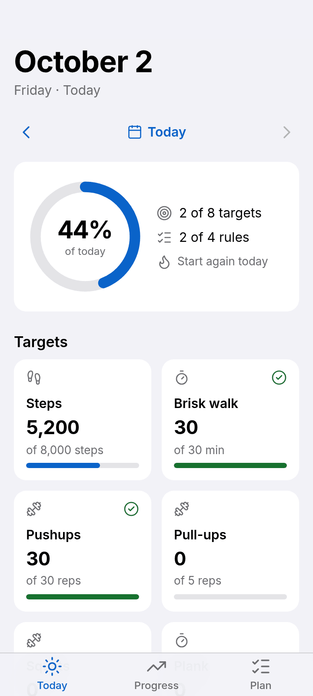 | 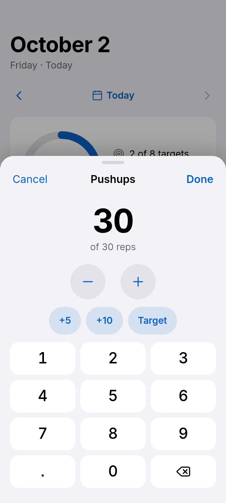 | 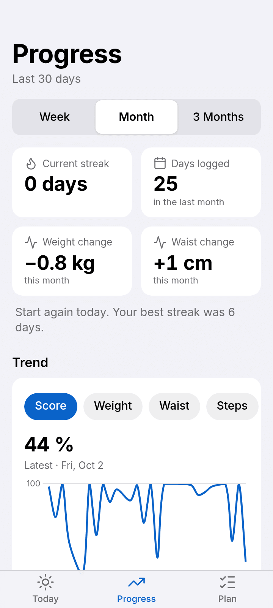 | 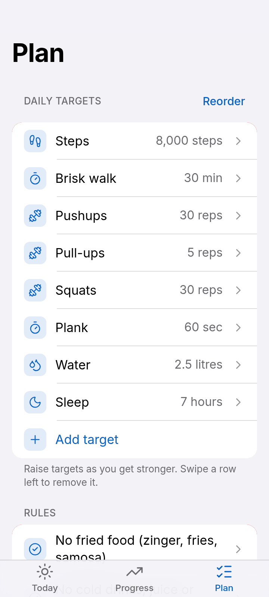 |
| 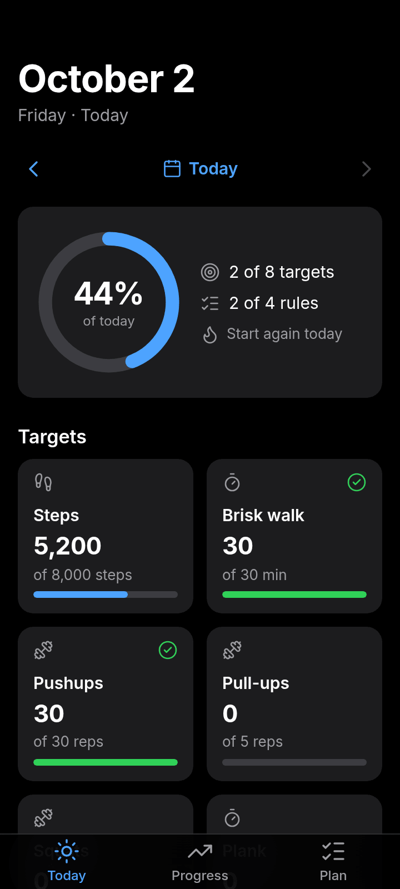 | 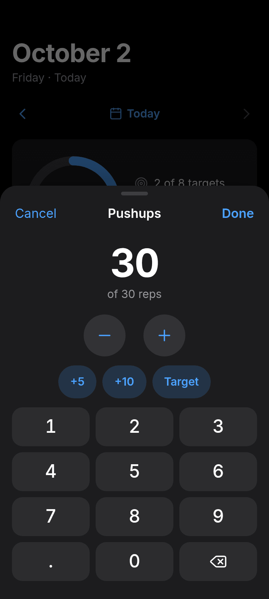 | 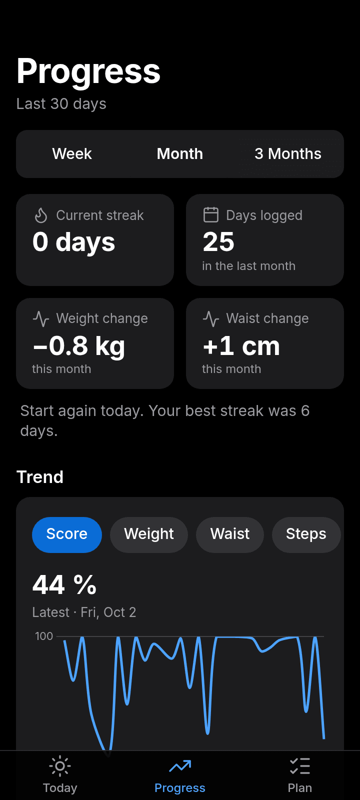 | 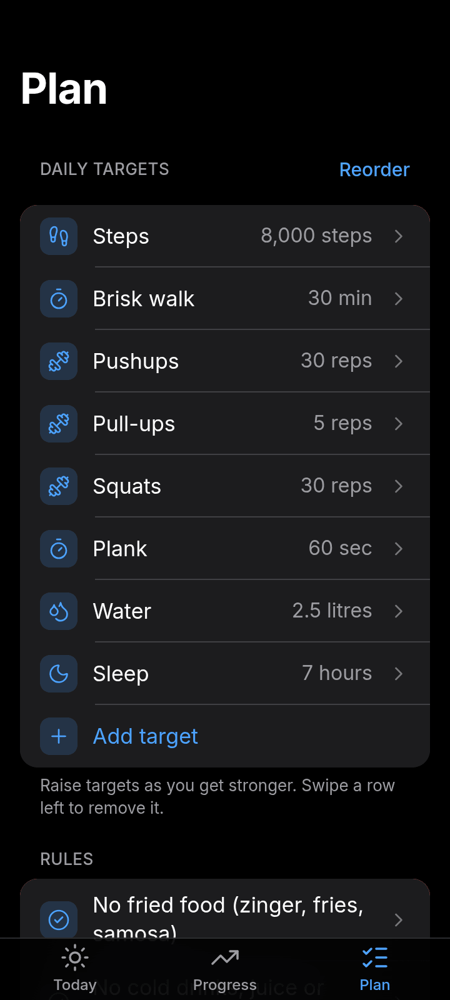 |

| Day done | Calendar | Day sheet | Intro |
| --- | --- | --- | --- |
| 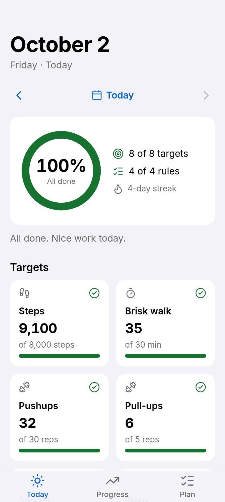 | 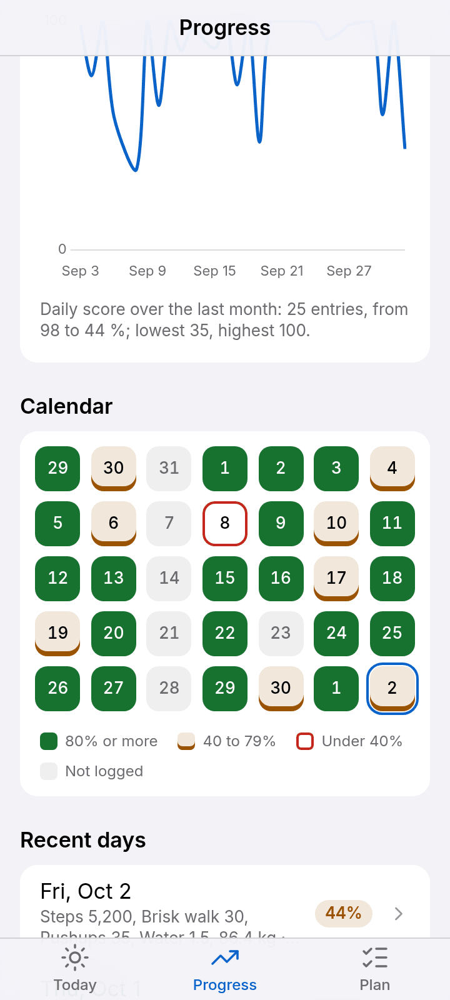 | 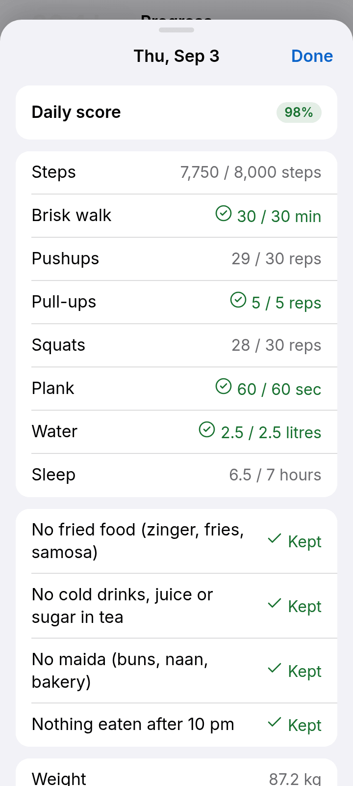 | 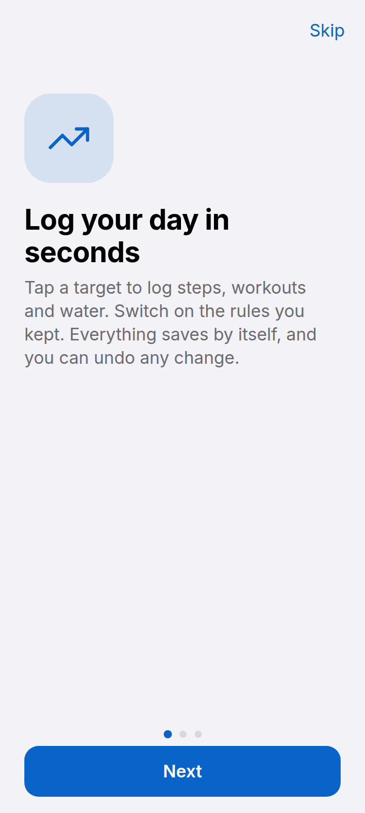 |
| 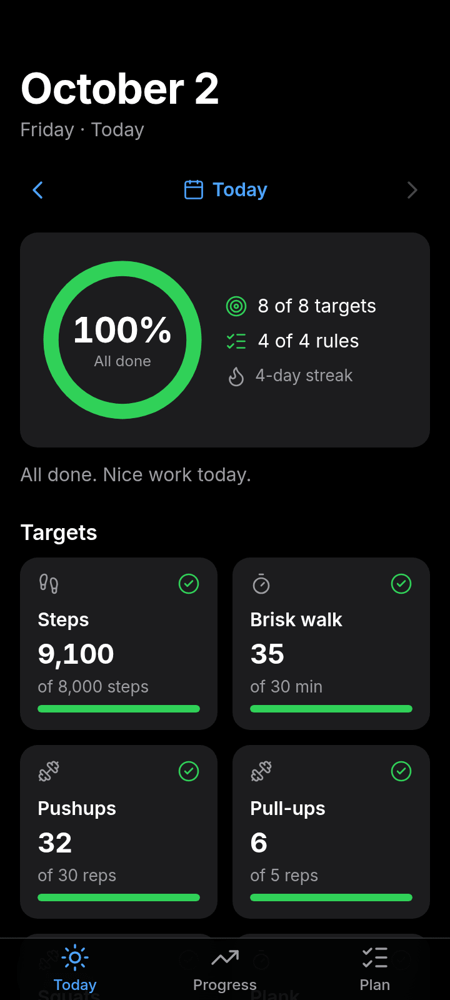 | 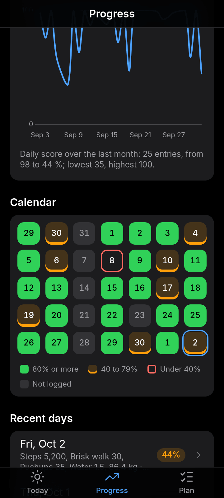 | 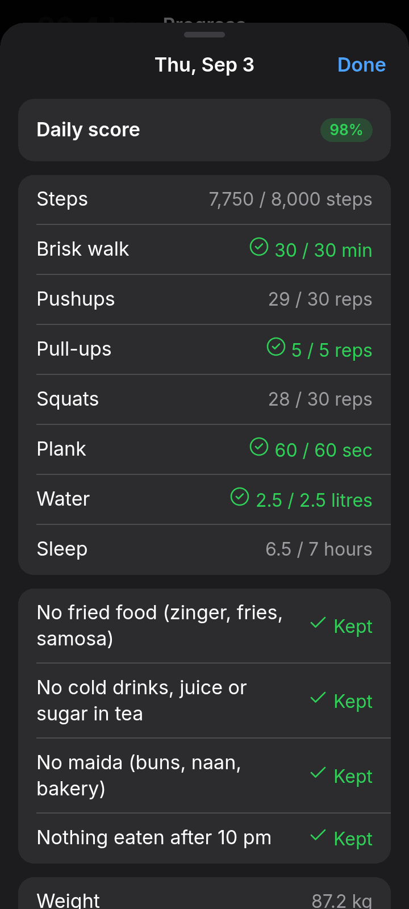 | 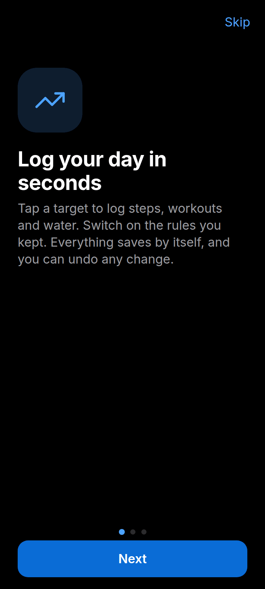 |

All 142 screenshots (every screen, sheet and the intro, at 360x800 and 412x915, light and dark, plus 130% text) are in [`docs/screenshots`](docs/screenshots). Regenerate them with `node scripts/screenshots.mjs`.

## Install the APK


1. Get `release/ResetLog-debug.apk` onto your phone (download it from this repo, or take it from the latest GitHub Actions run, see below).
2. Open it. Android will ask you to allow **Install unknown apps** for the app you opened it from (Files, Chrome, etc.). Allow it, then tap Install.
3. Open **Reset Log**. On Android 13+ the first time you switch the daily reminder on, allow notifications.

Every build uses the same signing key, so a newer APK installs straight over an older one and keeps your data. Don't uninstall first, because uninstalling deletes the app's data.

## Cloud sync (optional)

The app works fully without an account. If you want your log on more than one phone, or safe in the cloud, sync it with a free account.

**Create an account**
1. Open **My plan > Cloud sync > Sign in to sync**.
2. Enter your email and a password (at least 6 characters) and tap **Create account**.
3. Supabase emails you a confirmation link. Tap it, then come back and tap **Sign in**. Until you confirm, the app says "Check your email to confirm your account, then sign in."
4. On another phone, install the app and sign in with the same email and password. Your whole history downloads.

**How sync works**
- The phone always keeps its own copy and the app reads from that. The cloud is a second copy.
- Every time you save a day (or change your plan) the change is sent to the cloud straight away.
- When you open the app, come back to it, sign in, or tap **Sync now**, the app downloads everything in your account and compares it with the phone, day by day. The version with the newer save time wins, and anything the cloud is missing is uploaded.
- The first time you sign in on a phone that already has entries, those entries are uploaded.
- Restoring a backup while signed in also sends the restored days to the cloud. If you choose **Replace everything**, days that exist only in the cloud come back on the next sync.
- **Sign out** keeps all your entries on the phone. They stop syncing until you sign in again.
- The sync line on the card shows "Syncing…", "Synced at <time>", "<n> changes waiting to sync", or the error.

**Offline**
- Saving works without internet. Changes that couldn't be sent wait in a queue on the phone ("2 changes are waiting to sync").
- The queue is sent automatically when you open the app, when you return to it, and when the connection comes back. The queue survives closing the app.
- If two phones edited the same day while one was offline, the later save wins when the offline one reconnects.

**Letting anyone register (owner setup, one time)**

By default a new Supabase project only sends sign up emails to people on your Supabase team (and only a few per hour), and it links to a "Site URL" of `localhost`. So out of the box only you could register. Pick one of these in the Supabase dashboard for the `reset-log` project:

- **Simplest: no confirmation email.** Authentication > Sign In / Providers > Email > turn **off** "Confirm email" > Save. Anyone can then create an account in the app and is signed in straight away. No email is sent. The downside is that addresses aren't verified, and you can't send password resets.
- **Keep the confirmation email.** Project Settings > Authentication > SMTP Settings > turn on **Custom SMTP** and enter the details from an email service (for example Resend, Brevo or Postmark). Then set Authentication > URL Configuration > Site URL to a page you control, because the link in the email opens a browser, not the app.

Either way every account gets its own rows. Row Level Security means one user can never read or change another user's entries.

**Privacy.** Your data is stored in a Supabase database with Row Level Security: your account can only read and write its own rows. The app only contains the project's publishable key (`www/config.js`), never an admin key. The auto backup and export files described below still work the same, signed in or not.

## Where backups are stored

- **Automatic:** every time you save a day (or change your plan), the app writes your full data to `Documents/ResetLog/resetlog-autobackup.json`. It also keeps one copy per day as `resetlog-autobackup-YYYY-MM-DD.json` for the last 7 days; older ones are deleted.
- **Manual:** My plan > Backup > *Export backup (JSON)* saves `resetlog-backup-YYYY-MM-DD.json` in the same folder and opens the share sheet (Drive, WhatsApp, email...). *Export as spreadsheet (CSV)* does the same with a one-row-per-day file you can open in Excel or Sheets.
- Before a restore, the app saves what is on the phone as `resetlog-before-restore.json` in that folder.
- "Last backup" on the Backup card shows when a backup was last written.

## Restore on a new phone

1. Install the APK on the new phone.
2. Copy a backup file to the phone (from Drive, WhatsApp, email, or `Documents/ResetLog/`).
3. Open Reset Log > **My plan** > **Restore from backup** and pick the `.json` file.
4. The app shows how many days it contains. Choose **Merge** (keeps what is on the phone; for a day that exists in both, the newer save wins) or **Replace everything**.

Backups use this shape, so old and new backups stay compatible:

```json
{ "version": 1,
  "settings": { "habits": [], "rules": [] },
  "days": { "YYYY-MM-DD": { "vals": {}, "rules": {}, "weight": null, "waist": null, "note": "", "date": "YYYY-MM-DD", "updatedAt": 0 } } }
```

## Build it yourself

You need Node 22, JDK 21 and the Android SDK (platform 36).

```bash
npm ci
npm run build:apk        # bundles plugins, syncs www/ into android/, runs Gradle
# result: android/app/build/outputs/apk/debug/app-debug.apk
```

- The web app is `www/index.html` with `www/css/app.css`, `www/js/logic.js` (data, storage, backup, reminder, sync) and `www/js/ui.js` (screens and sheets). The Capacitor plugins and supabase-js are bundled from `src/native.js` into `www/vendor/native.js`, and the Lucide icons into `www/vendor/icons.js`, by `npm run build:web`.
- `npm run test:contrast` checks WCAG AA colour contrast. `npm run test:web` and `npm run test:sync` run the headless-browser tests (they need a Chromium for Playwright). `test:sync` uses a fake Supabase server; `npm run test:real` runs the same kind of checks against the real project and needs `E2E_EMAIL` and `E2E_PASSWORD` of an existing confirmed user.
- `supabase/migrations/` holds the SQL that creates the two tables and their security policies. The Supabase URL and publishable key are in `www/config.js`.
- `npm run assets` regenerates icons and splash screens from `assets/`.

### Rebuild on GitHub

`.github/workflows/build-apk.yml` builds the debug APK on every push to `main` (and on demand from the Actions tab). Open the run and download the **ResetLog-debug-apk** artifact.
