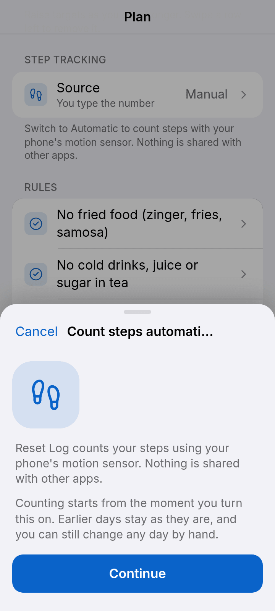
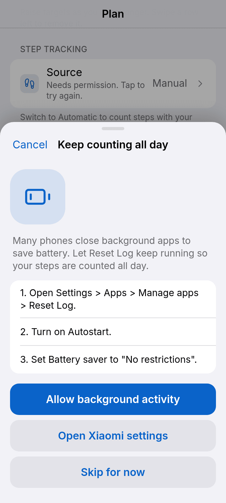
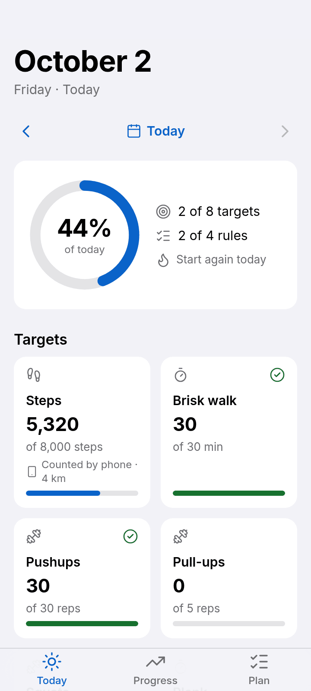
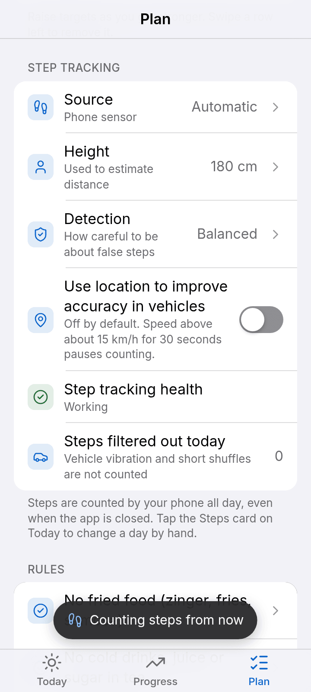
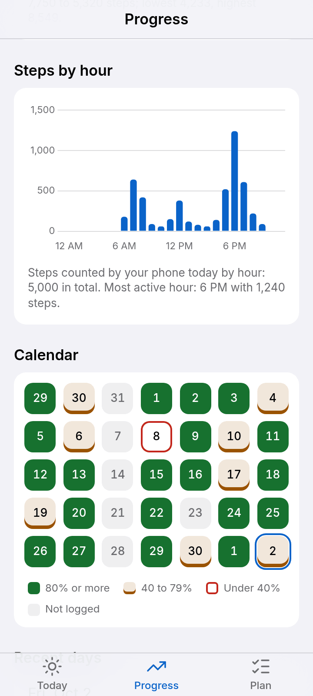
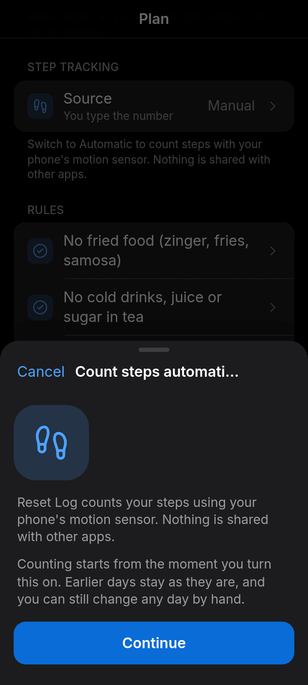
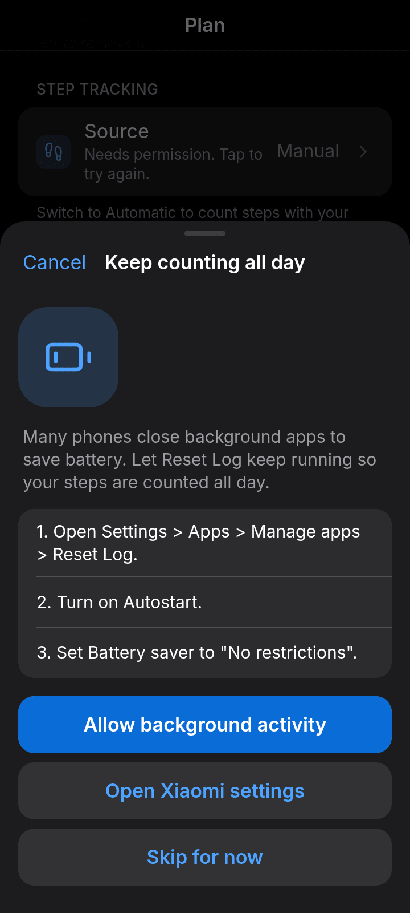
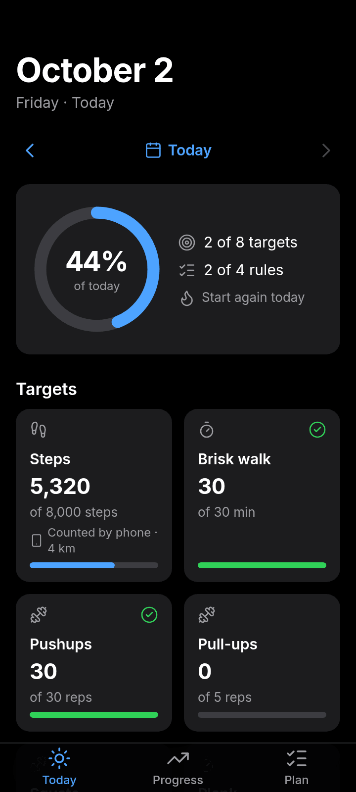
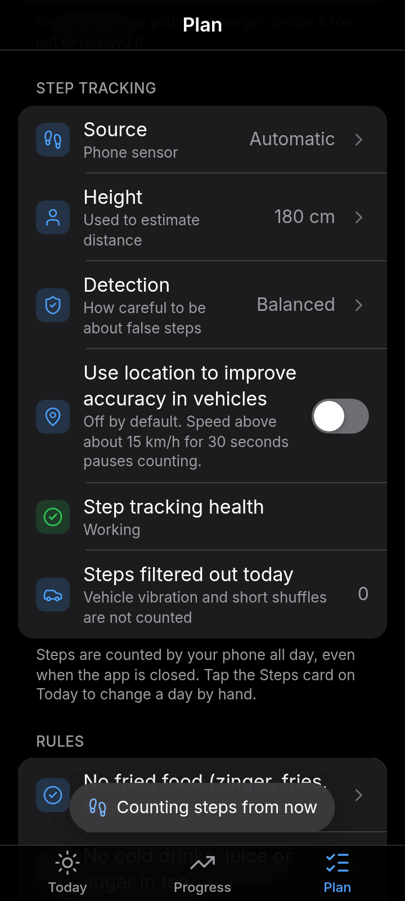
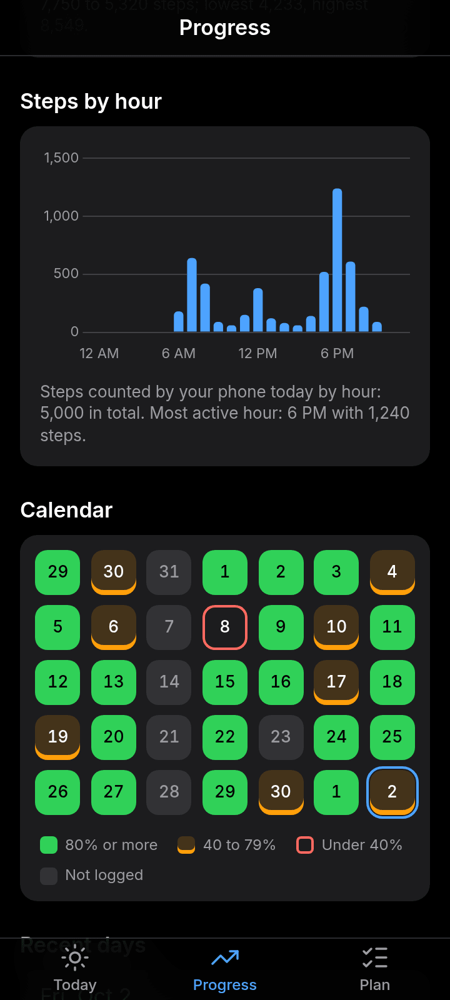

# Reset Log

A personal daily health tracker (workouts, steps, rules, weight, waist, notes, progress charts) packaged as an offline Android app with Capacitor.

- App ID: `com.umar.resetlog` — minSdk 23, target SDK 36
- Works fully offline (Chart.js, the Inter font and the icons are bundled)
- Data is stored with Capacitor Preferences on the phone
- Automatic step counting, backup, restore, a daily reminder and optional cloud sync are on the **Plan** tab

## Design

The UI follows the principles behind Apple's Human Interface Guidelines (clarity, deference, depth, consistency) with an original look. It uses no Apple fonts, icons or branding: the typeface is **Inter** and the icons are **Lucide** (1.75px stroke), both bundled locally (see `THIRD_PARTY.md`).

- **Today:** the date as a large title, one progress ring, a card per target (tap to log with a big number, steppers and a number pad; long-press for quick +500 / +10 presets), rules as switches, body and notes as rows that open sheets. Every change saves by itself, shows "Saved", and can be undone for 5 seconds.
- **Progress:** Week / Month / 3 Months, stat tiles, a trend chart you can touch and drag across to read exact values, a calendar of soft squares (tap a day to open it), and recent days.
- **Plan:** grouped lists for targets, rules, reminder, account and sync, backup and about. Swipe a row left to remove it (with confirmation), use Reorder to drag targets, and edit or add in bottom sheets.
- **Feel:** light haptics on taps, a success haptic when a target is reached, a short celebration when the whole day is done, and neutral wording on quiet days ("Not logged", "Start again today"). Reduce-motion turns animations into simple fades.
- **Accessibility:** works at 130% text size, 44px minimum tap targets, labelled controls, text summaries for the ring and chart, status never shown by colour alone, and WCAG AA contrast in light and dark (`npm run test:contrast`).

| Today | Log a value | Progress | Plan |
| --- | --- | --- | --- |
|  |  |  |  |
|  |  |  |  |

| Day done | Calendar | Day sheet | Intro |
| --- | --- | --- | --- |
|  |  |  |  |
|  |  |  |  |

**Automatic steps**

| Setup | Battery help | Steps card | Step tracking | Progress |
| --- | --- | --- | --- | --- |
|  |  |  |  |  |
|  |  |  |  |  |

All screenshots (every screen, sheet, the step-tracking flow and the intro, at 360x800 and 412x915, light and dark, plus 130% text) are in [`docs/screenshots`](docs/screenshots). Regenerate them with `node scripts/screenshots.mjs`.

## Install the APK


1. Get `release/ResetLog-debug.apk` onto your phone (download it from this repo, or take it from the latest GitHub Actions run, see below).
2. Open it. Android will ask you to allow **Install unknown apps** for the app you opened it from (Files, Chrome, etc.). Allow it, then tap Install.
3. Open **Reset Log**. On Android 13+ the first time you switch the daily reminder on, allow notifications.

Every build uses the same signing key, so a newer APK installs straight over an older one and keeps your data. Don't uninstall first, because uninstalling deletes the app's data.

## Automatic steps (phone sensor)

Reset Log can count your steps by itself using the phone's own motion sensors. It does **not** use Health Connect, Google Fit, Samsung Health or any other health app, and nothing is shared with other apps. Everything is counted and stored on the phone. (This is Android-app only; in a browser, steps stay manual.)

**Turn it on:** Plan > Step tracking > **Source** > Automatic (phone sensor). The app explains what it does, asks for the "Physical activity" permission (and notifications on Android 13+), helps you keep it running in the background (see the battery section), and asks your height once (default 180 cm). Counting starts from that moment: earlier days stay as they are. If you deny the permission, Steps stays on **Manual** and the Source row keeps a "try again" hint.

**Manual** works exactly as before: you type the number.

**On the Steps card (Today):** a small label says **Counted by phone** or **Edited manually**, plus the estimated distance (stride = 0.415 x height). Tap the card to change a day by hand (for example if you walked without your phone). That day is then "Edited manually" and automatic updates never overwrite it. The sheet has **Use counted steps (n)** to switch it back. A number you typed *before* switching on is kept the same way.

**Progress:** average steps and average distance for the chosen range (Week / Month / 3 Months), the Steps chart tells you for each day whether it was counted or manual, and an hourly bar chart shows when you were active today.

**What is stored (per day, inside the normal day record):** `vals.steps` plus `steps_meta`: `source` (`auto` or `manual`), `counted`, `distance_km`, `filtered`, and `hourly` (24 buckets). It is part of the JSON backup, the CSV export (columns *Steps source*, *Distance (km)*, *Filtered steps*) and cloud sync. Automatic updates reach the cloud at most once every 15 minutes. Your step settings (source, height, strictness, location check) belong to this phone and are not synced or backed up.

### How steps are counted

1. **Hardware step counter** (`TYPE_STEP_COUNTER`, the low-power chip) is the main source. The app keeps the last reading and adds the difference to the current day. If a reading is lower than the last one the phone rebooted, so the new reading counts as steps since the reboot. A walk that crosses midnight is split between the two days by time, and an alarm takes a reading just after midnight. `TYPE_STEP_DETECTOR` (when present) supplies each step's timestamp for the rhythm checks and live updates.
2. **Accelerometer fallback** for phones with no step sensor: the acceleration magnitude is band-pass filtered to the walking range (about 0.8 to 3 Hz) and peaks are picked with a minimum height and spacing. Sensitivity (Low / Normal / High) is adjustable in Plan. It uses more battery (it holds a partial wake lock) and needs a slightly longer steady walk (4 extra steps) before it counts.
3. Everything is saved in native storage (not the WebView), so nothing is lost if the app is closed. The web app reads the daily totals when it opens and while it is open.

### Keeping vehicles out

All of this runs on the phone. Detection strictness (Relaxed / Balanced / Strict) is in Plan.

| Layer | What it does |
| --- | --- |
| **Activity Recognition** (Google Play services Transition API, on-device) | While IN_VEHICLE or ON_BICYCLE is active, steps are discarded; counting resumes on WALKING, RUNNING or STILL. Steps accepted shortly before the detection are cancelled too. Skipped on phones without Play services (for example Huawei). |
| **Rhythm validation** | Steps must come at about 1.2 to 3 per second with an even rhythm (interval variation under about 25%). Irregular bursts are rejected. |
| **Buffering** | New steps are held until about 10 steady steps in a row (Relaxed 6, Strict 14). Short shuffles of 3 to 5 steps are discarded. Once walking is confirmed, steps count until the rhythm stops for about 3 seconds. Accepted steps also wait a short hold-back (30 to 120 seconds) so a late "you are in a vehicle" message can still cancel them. |
| **Vibration filtering** (accelerometer mode) | Band-pass 0.8 to 3 Hz, minimum peak height and spacing, steady step strength, and rejection of very large peaks (shaking). |
| **Speed check** (optional, off) | Plan > "Use location to improve accuracy in vehicles". If speed stays above about 15 km/h for 30 seconds, steps in that window are discarded. Location permission is asked only when you switch it on. |

Plan > Step tracking shows **Step tracking health** (Working / Paused by battery settings / Permission missing / Steps paused while in vehicle, with a one-tap fix where it applies) and **Steps filtered out today**.

### Keep it running (battery settings)

Many phones stop background apps. Switching on Automatic opens a setup sheet that asks Android to exclude Reset Log from battery optimisation and shows steps for your brand, with a button that opens the right settings screen where possible. If counting pauses later, Plan shows "Paused by battery settings" with the same help.

| Brand | What to set |
| --- | --- |
| Xiaomi / Redmi / POCO | Settings > Apps > Manage apps > Reset Log: turn on **Autostart**, set **Battery saver** to **No restrictions**. |
| Oppo / Realme / OnePlus | Settings > Battery > Reset Log: allow background activity and auto-launch, turn off "Optimize battery use". |
| Vivo / iQOO | Settings > Battery > Background power consumption: allow Reset Log; turn on Autostart in the phone manager. |
| Samsung | Settings > Battery > Background usage limits: remove Reset Log from Sleeping apps and Deep sleeping apps; set it to **Unrestricted**. |
| Huawei / Honor | Settings > Apps > App launch > Reset Log: turn off "Manage automatically", turn on Auto-launch, Secondary launch and Run in background. |
| Infinix / Tecno / itel | Phone Master (or Settings) > App management > Autostart: allow Reset Log; set battery use to "No restrictions". |
| Other | Settings > Apps > Reset Log > Battery > Unrestricted ("Don't optimize"), and allow it in any Autostart / Background apps list. |

The app restarts counting after the phone reboots or the app is updated. A 15-minute WorkManager check brings the service back if the system killed it, and the hardware counter keeps counting while the service is down, so steps are caught up later (without the rhythm checks, but still honouring vehicle periods). While counting, a quiet notification reads "Counting steps · 4,320 today"; tapping it opens the app.

### Accuracy notes

- The hardware counter is as accurate as your phone's chip. Phones in a hand-held, swinging or pocketed position all work; a phone left in a bag can undercount.
- The rhythm and buffering rules mean the first few steps of a very short walk (under about 10 steps) and a brief shuffle are not counted. That is deliberate.
- Regular pedalling looks like slow walking to a step sensor. Bicycles are rejected by Activity Recognition (so on a phone without Play services, cycling can add steps). The same applies to a very smooth, regular vibration in a vehicle.
- Activity Recognition notices a ride after a minute or so. The hold-back cancels the steps from just before, but a ride longer than the hold-back window before detection can leak a few steps.
- On a bumpy ride with only the accelerometer and no Activity Recognition, a rare stretch of bumps can look like a short walk (about 10 to 15 steps in 10 minutes in our simulations).
- If the service is stopped for a long time, the catch-up from the hardware counter cannot judge rhythm; if part of that time was in a vehicle, at most half of the remaining time is counted as walking.
- Android 14 and newer require the "health" foreground-service permission; it is declared in the manifest.

### What is tested where

- `npm run test:android` runs 35 JVM unit tests with **simulated sensors** (no phone needed): walking with the phone in a pocket and in hand, running pace, batched counter reports, reboot reset, midnight split, missed samples (service down while walking, and while in a car), a smooth car ride, a motorbike on a bumpy road, a bicycle ride, short shuffles of 3 to 5 steps, vehicle-to-walking transitions, the speed check, phone shaking, strictness levels and state saving.
- `npm run test:steps` runs 85 browser tests of the web side against a fake plugin (setup flow, permission denied, override and "Use counted steps", protection of manual days, settings, health states, sync throttling, CSV, backup and Progress).
- **Needs a real phone:** the actual sensors, Activity Recognition, background survival on your brand, the notification, and the numbers below.

**Check it on your phone**

1. *500-step walk:* switch to Automatic, note the Steps value, walk 500 steps counting by hand at a normal pace (phone in a pocket, then another run in your hand), and compare. Expect within about 3 to 5%.
2. *10-minute ride:* start the app counting, then ride 10 minutes in a car or on a motorbike with the phone on you. The Steps value should rise by close to 0 (a handful at most). Check Plan > "Steps filtered out today". Repeat on a bumpy road if you can.
3. Leave it running for a day with the screen off and see that the notification is still there and the total is sensible.

## Cloud sync (optional)

The app works fully without an account. If you want your log on more than one phone, or safe in the cloud, sync it with a free account.

**Create an account**
1. Open **My plan > Cloud sync > Sign in to sync**.
2. Enter your email and a password (at least 6 characters) and tap **Create account**.
3. Supabase emails you a confirmation link. Tap it, then come back and tap **Sign in**. Until you confirm, the app says "Check your email to confirm your account, then sign in."
4. On another phone, install the app and sign in with the same email and password. Your whole history downloads.

**How sync works**
- The phone always keeps its own copy and the app reads from that. The cloud is a second copy.
- Every time you save a day (or change your plan) the change is sent to the cloud straight away.
- When you open the app, come back to it, sign in, or tap **Sync now**, the app downloads everything in your account and compares it with the phone, day by day. The version with the newer save time wins, and anything the cloud is missing is uploaded.
- The first time you sign in on a phone that already has entries, those entries are uploaded.
- Restoring a backup while signed in also sends the restored days to the cloud. If you choose **Replace everything**, days that exist only in the cloud come back on the next sync.
- **Sign out** keeps all your entries on the phone. They stop syncing until you sign in again.
- The sync line on the card shows "Syncing…", "Synced at <time>", "<n> changes waiting to sync", or the error.

**Offline**
- Saving works without internet. Changes that couldn't be sent wait in a queue on the phone ("2 changes are waiting to sync").
- The queue is sent automatically when you open the app, when you return to it, and when the connection comes back. The queue survives closing the app.
- If two phones edited the same day while one was offline, the later save wins when the offline one reconnects.

**Letting anyone register (owner setup, one time)**

By default a new Supabase project only sends sign up emails to people on your Supabase team (and only a few per hour), and it links to a "Site URL" of `localhost`. So out of the box only you could register. Pick one of these in the Supabase dashboard for the `reset-log` project:

- **Simplest: no confirmation email.** Authentication > Sign In / Providers > Email > turn **off** "Confirm email" > Save. Anyone can then create an account in the app and is signed in straight away. No email is sent. The downside is that addresses aren't verified, and you can't send password resets.
- **Keep the confirmation email.** Project Settings > Authentication > SMTP Settings > turn on **Custom SMTP** and enter the details from an email service (for example Resend, Brevo or Postmark). Then set Authentication > URL Configuration > Site URL to a page you control, because the link in the email opens a browser, not the app.

Either way every account gets its own rows. Row Level Security means one user can never read or change another user's entries.

**Privacy.** Your data is stored in a Supabase database with Row Level Security: your account can only read and write its own rows. The app only contains the project's publishable key (`www/config.js`), never an admin key. The auto backup and export files described below still work the same, signed in or not.

## Where backups are stored

- **Automatic:** every time you save a day (or change your plan), the app writes your full data to `Documents/ResetLog/resetlog-autobackup.json`. It also keeps one copy per day as `resetlog-autobackup-YYYY-MM-DD.json` for the last 7 days; older ones are deleted.
- **Manual:** My plan > Backup > *Export backup (JSON)* saves `resetlog-backup-YYYY-MM-DD.json` in the same folder and opens the share sheet (Drive, WhatsApp, email...). *Export as spreadsheet (CSV)* does the same with a one-row-per-day file you can open in Excel or Sheets.
- Before a restore, the app saves what is on the phone as `resetlog-before-restore.json` in that folder.
- "Last backup" on the Backup card shows when a backup was last written.

## Restore on a new phone

1. Install the APK on the new phone.
2. Copy a backup file to the phone (from Drive, WhatsApp, email, or `Documents/ResetLog/`).
3. Open Reset Log > **My plan** > **Restore from backup** and pick the `.json` file.
4. The app shows how many days it contains. Choose **Merge** (keeps what is on the phone; for a day that exists in both, the newer save wins) or **Replace everything**.

Backups use this shape, so old and new backups stay compatible:

```json
{ "version": 1,
  "settings": { "habits": [], "rules": [] },
  "days": { "YYYY-MM-DD": { "vals": {}, "rules": {}, "weight": null, "waist": null, "note": "", "date": "YYYY-MM-DD", "updatedAt": 0 } } }
```

## Build it yourself

You need Node 22, JDK 21 and the Android SDK (platform 36).

```bash
npm ci
npm run build:apk        # bundles plugins, syncs www/ into android/, runs Gradle
# result: android/app/build/outputs/apk/debug/app-debug.apk
```

- The web app is `www/index.html` with `www/css/app.css`, `www/js/logic.js` (data, storage, backup, reminder, sync) and `www/js/ui.js` (screens and sheets). The Capacitor plugins and supabase-js are bundled from `src/native.js` into `www/vendor/native.js`, and the Lucide icons into `www/vendor/icons.js`, by `npm run build:web`.
- `npm run test:android` (Kotlin sensor tests), `npm run test:steps` (step tracking UI) and `npm run test:contrast` (WCAG AA colour contrast). `npm run test:web` and `npm run test:sync` run the headless-browser tests (they need a Chromium for Playwright). `test:sync` uses a fake Supabase server; `npm run test:real` runs the same kind of checks against the real project and needs `E2E_EMAIL` and `E2E_PASSWORD` of an existing confirmed user.
- `supabase/migrations/` holds the SQL that creates the two tables and their security policies. The Supabase URL and publishable key are in `www/config.js`.
- `npm run assets` regenerates icons and splash screens from `assets/`.

### Rebuild on GitHub

`.github/workflows/build-apk.yml` builds the debug APK on every push to `main` (and on demand from the Actions tab). Open the run and download the **ResetLog-debug-apk** artifact.
